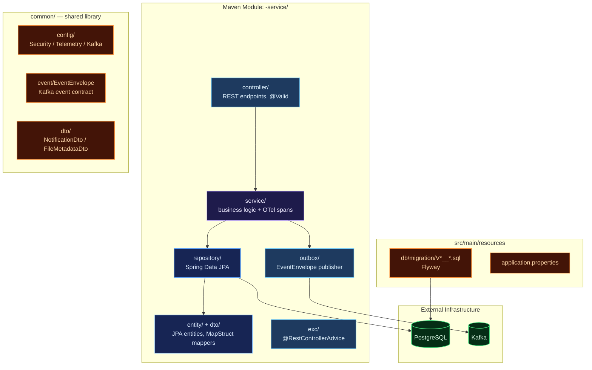
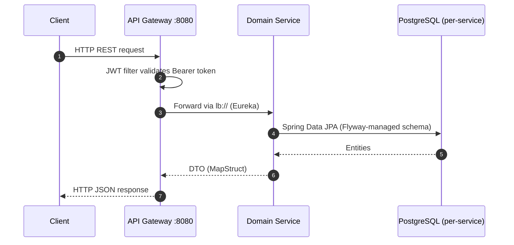
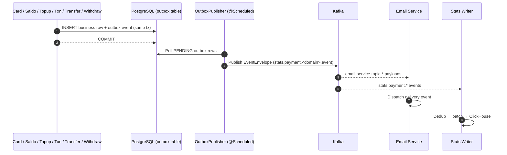

# Distributed Microservices — Payment Gateway Platform (Spring Boot Cloud)

A production-grade, fully observable **microservices payment gateway backend** built in **Java 21** on **Spring Boot 3.5.3** and **Spring Cloud 2025.0.0**. Designed around domain-driven service boundaries, each financial and identity business domain — Users, Roles, Auth, Cards, Merchants, Saldo, Topups, Transactions, Transfers, Withdrawals — lives in its own self-contained Maven module, running as an **independent JVM process** with its own REST API, PostgreSQL database, and Flyway migrations, achieving true service-level isolation and independent deployability.

Services register with **Netflix Eureka** for service discovery and communicate synchronously via **OpenFeign** REST clients. A **Spring Cloud Gateway** (WebFlux) acts as the unified reactive entry point with JWT authentication at the edge. Domain mutations publish **Apache Kafka** events through the **transactional outbox pattern** (6 outbox-equipped services), feeding the email worker and the ClickHouse analytics pipeline.

The platform ships with a **comprehensive observability suite** (OpenTelemetry Collector, Prometheus, Grafana, Loki, Jaeger) and full Docker Compose orchestration.

---

## Key Features

| Domain | Capabilities |
| :--- | :--- |
| **Auth & Users** | Registration and login with stateless JWT tokens (jjwt), BCrypt password hashing, Feign-backed user lookup for authentication. |
| **Roles & RBAC** | Role entities with composite `user_roles` assignments (assign/remove/lookup by user), JPQL role-name projections. |
| **Cards** | Card CRUD with unique card numbers, `CardStatus` lifecycle (ACTIVE/SUSPENDED/BLOCKED), credit limits & points, plus an idempotency-guarded authorization ledger (`card_auth_transactions`). Card numbers/CVV are immutable via update. |
| **Merchants** | Merchant onboarding with auto-generated merchant numbers & API keys (`@PrePersist`), document management, status workflow. |
| **Saldo (Balance)** | Real-time balance tracking keyed by card number with a ledger-grade mutation operation: idempotency keys, minimum-balance enforcement, and per-operation audit rows (`saldo_mutation_operations`). |
| **Topup** | Balance funding records with idempotency-key deduplication, request fingerprints, and status lifecycle (PENDING/SUCCESS/FAILED/COMPENSATION_*). |
| **Transaction** | Central financial audit ledger with idempotency keys and status tracking. |
| **Transfer** | P2P card-to-card transfer records with idempotency keys (bookkeeping ledger; no saldo integration — see Design Decisions). |
| **Withdraw** | Withdrawal records with idempotency keys (bookkeeping ledger; no limits/saldo integration — see Design Decisions). |
| **Email Worker** | Kafka-driven asynchronous worker logging delivery events (8 listeners: register, saldo, topup, transfer, withdraw, transaction, merchant create/status). |
| **Transactional Outbox** | All six domain services (card, saldo, topup, transaction, transfer, withdraw) publish `stats.payment.*` events via an outbox table + scheduled publisher — no event loss during Kafka outages. |
| **ClickHouse Analytics** | Three-component pipeline: stats-writer (Kafka→ClickHouse), stats-reader (REST→Redis cache), stats-backfill (PostgreSQL→outbox→Kafka→ClickHouse). |
| **Observability** | OpenTelemetry traces/metrics to the OTel Collector, Prometheus metrics, Grafana dashboards, Loki log aggregation, Jaeger tracing. |
| **Deployment** | Docker Compose orchestration with 9 per-service PostgreSQL databases, RabbitMQ, Kafka, Redis, ClickHouse, and the observability stack. |

---

## Architecture Overview

The platform implements a **Spring Cloud microservices** architecture. Every business service is a standalone Spring Boot application with its own port, database, and Flyway migration set. Services register with **Eureka** and resolve each other through load-balanced calls; the **Spring Cloud Gateway** is the single edge router, applying JWT validation per route before forwarding.

### Core Architecture Principles

- **Service-Level Isolation**: One JVM process, one database, one migration chain per business domain. No shared databases.
- **Layered Modules**: `Controller → Service → Repository` with MapStruct DTO mappers; compact `@RestControllerAdvice` error handling.
- **Service Discovery**: Netflix Eureka — services address each other by logical name (`lb://service-name`).
- **Event-Driven Resilience**: Every fund-movement domain writes `EventEnvelope` rows to an outbox table inside the business transaction; a `@Scheduled` publisher relays them to Kafka. Guaranteed at-least-once delivery to consumers.
- **OTel Telemetry**: A shared `TelemetryConfig` (or per-module copy) bootstraps the OTel SDK — spans, counters, and histograms (`requests_total`, `requests_duration_seconds`, `failure_total`) are recorded per service operation and exported over OTLP.

```mermaid
graph TB
    classDef client fill:#0f172a,stroke:#38bdf8,color:#e0f2fe,stroke-width:2px,font-weight:bold
    classDef gateway fill:#1e293b,stroke:#22d3ee,color:#cffafe,stroke-width:2px
    classDef domain fill:#1e1b4b,stroke:#818cf8,color:#e0e7ff,stroke-width:1.5px
    classDef infra fill:#172554,stroke:#60a5fa,color:#dbeafe,stroke-width:1.5px
    classDef obs fill:#052e16,stroke:#4ade80,color:#dcfce7,stroke-width:1.5px
    classDef event fill:#431407,stroke:#fb923c,color:#fed7aa,stroke-width:1.5px

    Client["Client Applications<br/>(Web / Mobile / API)"]:::client

    subgraph Edge["Edge Layer"]
        direction LR
        GW["Spring Cloud Gateway<br/>WebFlux Router :8080"]:::gateway
        JWT["JWT Auth Filter<br/>per route"]:::gateway
        EUREKA["Eureka Server<br/>Service Registry :8761"]:::gateway
    end

    Client -->|HTTP REST| GW
    GW -.->|register / resolve| EUREKA

    subgraph BusinessServices["Business Domain Services (Spring Boot)"]
        direction TB

        subgraph IdentityDomain["Identity & Access"]
            AUTH["Auth Service :8085<br/>JWT + Feign to user"]:::domain
            USER["User Service :8084"]:::domain
            ROLE["Role Service :8088<br/>RBAC assignments"]:::domain
        end

        subgraph MerchantDomain["Merchant Management"]
            MERCH["Merchant Service :8089"]:::domain
        end

        subgraph FinanceDomain["Finance & Ledger Suite"]
            CARD["Card Service :8091<br/>cards + auth transactions"]:::domain
            SALDO["Saldo Service :8092<br/>balance + mutation ledger"]:::domain
        end

        subgraph MovementDomain["Fund Movements"]
            TOPUP["Topup Service :8093"]:::domain
            TXN["Transaction Service :8094"]:::domain
            TRANSFER["Transfer Service :8095"]:::domain
            WITHDRAW["Withdraw Service :8096"]:::domain
        end
    end

    GW -->|REST| AUTH
    GW -->|REST| USER
    GW -->|REST| ROLE
    GW -->|REST| MERCH
    GW -->|REST| CARD
    GW -->|REST| SALDO
    GW -->|REST| TOPUP
    GW -->|REST| TXN
    GW -->|REST| TRANSFER
    GW -->|REST| WITHDRAW

    subgraph Infrastructure["Infrastructure Layer"]
        direction LR
        PG[("PostgreSQL<br/>9 per-service DBs")]:::infra
        KAFKA[("Kafka<br/>Event Bus :9092")]:::infra
        REDIS[("Redis<br/>:6379")]:::infra
        CLICKHOUSE[("ClickHouse<br/>Analytics :8123")]:::infra
    end

    AUTH -->|JPA| PG
    USER -->|JPA| PG
    ROLE -->|JPA| PG
    MERCH -->|JPA| PG
    CARD -->|JPA| PG
    SALDO -->|JPA| PG
    TOPUP -->|JPA| PG
    TXN -->|JPA| PG
    TRANSFER -->|JPA| PG
    WITHDRAW -->|JPA| PG

    CARD -.->|outbox| KAFKA
    SALDO -.->|outbox| KAFKA
    TOPUP -.->|outbox| KAFKA
    TXN -.->|outbox| KAFKA
    TRANSFER -.->|outbox| KAFKA
    WITHDRAW -.->|outbox| KAFKA

    subgraph EventConsumers["Event-Driven Consumers"]
        EMAIL_W["Email Service :8094*<br/>8 Kafka listeners"]:::event
        STATS_W["Stats Writer :8095*<br/>batch to ClickHouse"]:::event
    end

    KAFKA -->|consume| EMAIL_W
    KAFKA -->|consume| STATS_W
    STATS_W --> CLICKHOUSE
    STATS_R["Stats Reader :8096*<br/>Redis-cached queries"]:::event
    STATS_R --> CLICKHOUSE
    STATS_R --> REDIS

    subgraph Observability["Observability Stack"]
        direction LR
        OTEL["OTel Collector"]:::obs
        PROM["Prometheus"]:::obs
        LOKI["Loki"]:::obs
        JAEGER["Jaeger"]:::obs
        GRAFANA["Grafana"]:::obs
    end

    AUTH -.->|OTLP| OTEL
    CARD -.->|OTLP| OTEL
    SALDO -.->|OTLP| OTEL
    TXN -.->|OTLP| OTEL
    GW -.->|OTLP| OTEL
    OTEL -.-> JAEGER
    OTEL -.-> PROM
    LOKI -.-> GRAFANA
    PROM -.-> GRAFANA
```



> *Port note: email/stats services declare server ports that collide with the transaction/transfer/withdraw services in `application.properties` (8094/8095/8096). In the Docker Compose topology they are container-internal only and never mapped — external clients always reach the platform through the gateway :8080, so the collision is inert in deployment. See Design Decisions.

---

## Service Catalog

**18 Maven modules** — 16 runtime services, 1 shared library, 1 seeder:

| # | Service | Module | Port | Responsibility |
| :- | :------ | :----- | :--- | :------------- |
| 1 | Eureka Server | `eureka-server` | 8761 | Service registry |
| 2 | API Gateway | `api-gateway` | 8080 | Spring Cloud Gateway (WebFlux), JWT filter, routing |
| 3 | Common | `common` | — | Shared library: DTOs, EventEnvelope, Kafka/Security/Telemetry config, seeder contracts |
| 4 | Auth | `auth-service` | 8085 | Login/register, JWT issuing (jjwt), Feign to user-service |
| 5 | User | `user-service` | 8084 | User CRUD, `findByUsername` for auth |
| 6 | Role | `role-service` | 8088 | Roles + composite user-role assignments |
| 7 | Merchant | `merchant-service` | 8089 | Merchant onboarding, documents, auto-generated merchantNo/apiKey |
| 8 | Card | `card-service` | 8091 | Card lifecycle + authorization ledger + outbox |
| 9 | Saldo | `saldo-service` | 8092 | Balance tracking + mutation ledger + outbox |
| 10 | Topup | `topup-service` | 8093 | Funding records + idempotency + outbox |
| 11 | Transaction | `transaction-service` | 8094 | Financial audit ledger + outbox |
| 12 | Transfer | `transfer-service` | 8095 | P2P transfer records + outbox |
| 13 | Withdraw | `withdraw-service` | 8096 | Withdrawal records + outbox |
| 14 | Email | `email-service` | 8094* | 8 Kafka listeners (delivery events) |
| 15 | Stats Writer | `stats-writer` | 8095* | Kafka → dedup → batch → ClickHouse |
| 16 | Stats Reader | `stats-reader` | 8096* | Aggregated queries, Redis cache |
| 17 | Stats Backfill | `stats-backfill` | — | One-shot PostgreSQL → outbox → Kafka backfill |
| 18 | Seeder | `seeder` | — | Idempotent wallet data seeding (identity, cards, saldo, movements) |

\* internal container port; not exposed externally in Docker Compose (gateway is the single entry point).

---

## Internal Service Architecture



---

## Data & Event Flow

### Synchronous Flow (Gateway → Service → DB)



### Asynchronous Flow — Kafka (Transactional Outbox)

Every fund-movement mutation writes an `EventEnvelope` to an `outbox` table inside the same database transaction, then a scheduled `OutboxPublisher` relays it to Kafka — guaranteeing no event loss during broker outages.



---

## Kafka Event Architecture

Events are published through the **transactional outbox** pattern with `EventEnvelope` (eventId, schemaVersion, eventType, occurredAt, domain, payload). Topic contracts live in `common/src/main/java/com/common/kafka/KafkaCommonConfig.java` — 25 provisioned topics (12 `NewTopic` bean groups).

### Topic Registry

| Category | Topics | Producer → Consumer |
| :------- | :----- | :------------------ |
| **Domain Events (7)** | `stats.payment.card.event`, `stats.payment.merchant.event`, `stats.payment.saldo.event`, `stats.payment.topup.event`, `stats.payment.transaction.event`, `stats.payment.transfer.event`, `stats.payment.withdraw.event` | Domain outbox → Stats Writer |
| **Email Notifications (8 listened)** | `email-service-topic-auth-register`, `-auth-forgot-password`, `-auth-verify-code-success`, `-saldo-create`, `-topup-create`, `-transaction-create`, `-transfer-create`, `-withdraw-create`, `-merchant-create`, `-merchant-update-status`, `-merchant-document-create`, `-merchant-document-update-status` | Domain services → Email Service (8 active listeners) |
| **Card Internal (4)** | `card.txn.created`, `card.fraud.alert`, `card.payment.posted`, `card.statement.generated` | Card services (provisioned, consumer wiring reserved) |
| **Saldo Lifecycle** | `saldo-service-topic-create-saldo` | Card → Saldo (provisioned) |
| **Notification** | `notification-topic` | Platform services (provisioned) |

All topics are provisioned by `KafkaCommonConfig` (3 partitions, replication factor 1).

### Outbox Publisher

Each of the six domain services (`card`, `saldo`, `topup`, `transaction`, `transfer`, `withdraw`) declares `@EnableScheduling` and runs a `@Scheduled(fixedDelay = 3000)` publisher: poll `PENDING` rows in creation order, send via `KafkaTemplate`, mark `PROCESSED`; after `MAX_ATTEMPTS = 5` failures the row is marked `FAILED` with the last error recorded.

---

## ClickHouse Analytics Layer

| Component | Role | Description |
| :-------- | :--- | :---------- |
| **stats-reader** | Query API (port `:8096*`) | Aggregated statistical queries against ClickHouse, Redis-cached with configurable TTL. |
| **stats-writer** | Kafka consumer (port `:8095*`) | Consumes `stats.payment.*` topics, deduplicates, batches, and flushes to ClickHouse. |
| **stats-backfill** | Batch loader | Reads historical OLTP rows into outbox tables → Kafka → stats-writer → ClickHouse. |

---

## Observability

All services export OpenTelemetry telemetry to the OTel Collector (`otel.exporter.otlp.endpoint`), which fans out to the storage backends. Prometheus scrapes collector-exposed metrics only — no per-service scrape duplication.

| Pillar | Tool | Purpose |
| :--- | :--- | :--- |
| **Tracing** | OpenTelemetry → Jaeger | End-to-end traces across gateway and services (W3C propagation). |
| **Metrics** | Prometheus + Grafana | OTel-collector scrape target, custom counters/histograms per service. |
| **Logging** | Loki + Logback | Centralized structured logs, queryable via LogQL. |

---

## Testing

The platform carries a **478-test suite, all green**, following a consistent three-layer strategy per module:

| Layer | Tooling | Coverage |
| :---- | :------ | :------- |
| **Service unit tests** | JUnit 5 + Mockito + AssertJ, `OpenTelemetry.noop()` | Happy paths, error contracts, outbox captures, idempotency guards, saldo mutation ledger |
| **Controller tests** | Standalone `MockMvc` (no Spring context) | Endpoint mapping, validation 400s, error-path status codes |
| **Repository tests** | `@DataJpaTest` + Testcontainers (`postgres:15-alpine`) + `@ServiceConnection` | Flyway-migrated schema validation, derived queries, unique constraints |

Existing `@SpringBootTest contextLoads` stubs were replaced by the real suites (they cannot run without the full infrastructure). Testcontainers checks are skipped automatically when Docker is unavailable; the test JVMs pin `docker-java` API 1.44 for Docker Engine 29 compatibility via `src/test/resources/docker-java.properties`.

Run everything:

```bash
mvn -pl common,auth-service,user-service,role-service,merchant-service,card-service,saldo-service,topup-service,transaction-service,transfer-service,withdraw-service,email-service,api-gateway test
```

---

## Design Decisions & Known Limitations

Keputusan desain yang disengaja (bukan bug) — didokumentasikan agar tidak "diperbaiki" tanpa sadar:

| ID | Keputusan | Perilaku | Alasan |
|---|---|---|---|
| PW-1 | **Wallet-only scope** | Tidak ada product/order/payment untuk demo belanja — platform murni kartu & saldo | Mirror 1:1 dengan versi Quarkus yang juga wallet-only |
| PW-2 | **Transfer/withdraw/topup = bookkeeping ledger** | Tidak ada integrasi saldo (debit/kredit otomatis), tidak ada limit | Movements tercatat sebagai event sourcing ledger; sinkronisasi saldo terjadi via `saldo.mutate()` yang dipanggil eksplisit |
| PW-3 | **Saldo `mutate()` check-then-act** | Idempotency dicek sebelum insert tanpa unique-violation fallback; kegagalan tidak menulis FAILED ledger row | Race window diterima pada skala ini; ledger audit tersedia untuk operasi sukses |
| PW-4 | **Card CVV tersimpan plaintext** | Kolom `cvv` varchar tanpa hashing | Demo platform; produksi wajib PCI-DSS vaulting |
| PW-5 | **Port collision email/stats (8094–8096)** | Sama dengan transaction/transfer/withdraw | Inert di Docker Compose (port internal container, tidak dipublish); gateway satu-satunya entry point |

---

## Getting Started

### Prerequisites

- Java 21 (Temurin)
- Maven 3.9+
- Docker & Docker Compose

### Build

```bash
mvn clean install -DskipTests
```

### Run the full stack

```bash
docker compose up -d
```

This provisions: Eureka, API Gateway, 9 per-service PostgreSQL databases, Kafka, Redis, ClickHouse, the email/stats services, the seeder, and the observability stack (OTel Collector, Prometheus, Grafana, Loki, Jaeger, node-exporter).

### Local development (single service)

```bash
mvn -pl card-service spring-boot:run
```

Each service registers with Eureka at `http://localhost:8761`; the gateway routes everything through `http://localhost:8080`.

### Verify health

```bash
curl -s http://localhost:8761/actuator/health      # Eureka
curl -s http://localhost:8080/actuator/health      # Gateway
```

---

## Project Structure

```
spring-boot-microservices-payment/
├── api-gateway/            # Spring Cloud Gateway (WebFlux), JWT filter
├── eureka-server/          # Service registry
├── common/                 # Shared DTOs, EventEnvelope, Kafka/Security/Telemetry config
├── auth-service/           # JWT issuing, Feign to user
├── user-service/           # User CRUD
├── role-service/           # Roles + user_roles
├── merchant-service/       # Merchant onboarding + documents
├── card-service/           # Cards + authorization ledger + outbox
├── saldo-service/          # Balance + mutation ledger + outbox
├── topup-service/          # Funding records + outbox
├── transaction-service/    # Audit ledger + outbox
├── transfer-service/       # P2P transfer records + outbox
├── withdraw-service/       # Withdrawal records + outbox
├── email-service/          # Kafka email worker (8 listeners)
├── stats-writer/           # Kafka → ClickHouse
├── stats-reader/           # ClickHouse queries + Redis cache
├── stats-backfill/         # Historical backfill
├── seeder/                 # Wallet data seeding
├── deployments/            # Kubernetes manifests
├── docker/                 # Compose init scripts
├── hurl/                   # REST smoke-test scripts
├── observability/          # Prometheus / OTel / Grafana config
└── docker-compose.yml      # Full-stack orchestration
```
